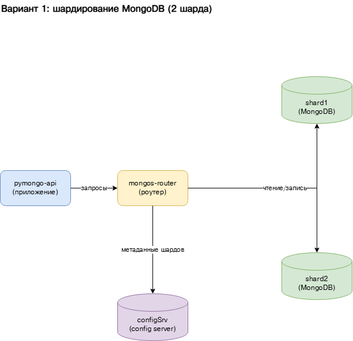

# pymongo-api (шардированный кластер MongoDB)

Вариант 1 из `Task1/task1_step1_sharding.drawio`: приложение `pymongo-api` ходит в
роутер `mongos`, который распределяет данные между двумя шардами (`shard1`,
`shard2`), а метаданные хранит на config-сервере (`configSrv`).

## Схема



## Состав кластера

| Сервис          | Роль                                   | Порт  |
|-----------------|----------------------------------------|-------|
| `configSrv`     | config server (replSet `config_server`)| 27017 |
| `shard1`        | шард (replSet `shard1`)                | 27018 |
| `shard2`        | шард (replSet `shard2`)                | 27019 |
| `mongos_router` | роутер запросов                        | 27020 |
| `pymongo_api`   | приложение (FastAPI)                   | 8080  |

## Как запустить

### Шаг 1. Поднять контейнеры

Запускаем config-сервер, шарды, роутер и приложение:

```shell
docker compose up -d
```

Проверяем, что все 5 контейнеров в статусе `Up`:

```shell
docker compose ps
```

### Шаг 2. Инициализировать кластер

Скрипт инициализирует реплика-сеты, регистрирует шарды в роутере, включает
шардирование базы `somedb` и наполняет коллекцию `helloDoc` 2000 документами:

```shell
./scripts/mongo-init.sh
```

> Скрипт делает паузу ~10 секунд, чтобы реплика-сеты успели выбрать PRIMARY.
> Повторный запуск не нужен — достаточно одного раза после `docker compose up`.

## Как проверить

### Шаг 3. Проверить приложение

#### Если вы запускаете проект на локальной машине

Откройте в браузере http://localhost:8080

#### Если вы запускаете проект на предоставленной виртуальной машине

Узнать белый ip виртуальной машины:

```shell
curl --silent http://ifconfig.me
```

Откройте в браузере http://<ip виртуальной машины>:8080

Ожидаемый ответ: в JSON поле `mongo_topology_type` равно `Sharded`,
`mongo_is_mongos` равно `true`, а в `shards` перечислены `shard1` и `shard2`.

```shell
curl -s http://localhost:8080/
```

### Шаг 4. Проверить распределение данных по шардам

Смотрим, как 2000 документов разложились между `shard1` и `shard2`:

```shell
docker compose exec -T mongos_router mongosh --port 27020 somedb --quiet --eval "db.helloDoc.getShardDistribution()"
```

Ожидаемо: документы распределены примерно поровну между двумя шардами
(суммарно 2000 документов).

Статус всего кластера шардирования:

```shell
docker compose exec -T mongos_router mongosh --port 27020 --quiet --eval 'sh.status()'
```

## Доступные эндпоинты

Список доступных эндпоинтов, swagger http://<ip виртуальной машины>:8080/docs

## Как остановить

Остановить контейнеры:

```shell
docker compose down
```

Остановить и удалить данные (тома):

```shell
docker compose down -v
```
