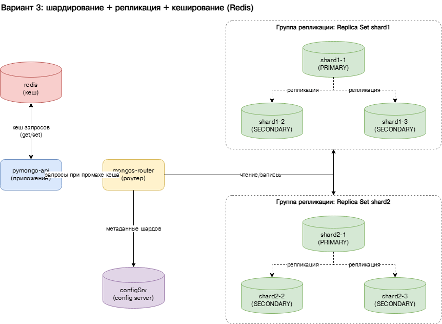

# pymongo-api (шардированный кластер MongoDB + репликация + кеширование)

Вариант 3 из `sharding-repl-cache.drawio`: приложение `pymongo-api` ходит в
роутер `mongos`, который распределяет данные между двумя шардами (`shard1`,
`shard2`), а метаданные хранит на config-сервере (`configSrv`). Каждый шард
является реплика-сетом из 3 узлов (1 PRIMARY + 2 SECONDARY), что обеспечивает
отказоустойчивость и сохранность данных. Поверх этого добавлен **кеш Redis**:
приложение сначала проверяет кеш и ходит в MongoDB только при промахе, что
снижает нагрузку на кластер и ускоряет повторные запросы.

Кеширование включается переменной окружения `REDIS_URL`
(`redis://<redis-service-name>:6379`). Если переменная не задана, приложение
работает без кеша.

## Схема



## Состав кластера

| Сервис          | Роль                                         | Порт (host:container) |
|-----------------|----------------------------------------------|-----------------------|
| `configSrv`     | config server (replSet `config_server`)      | 27017:27017           |
| `shard1-1`      | шард 1, PRIMARY (replSet `shard1`)           | 27018:27018           |
| `shard1-2`      | шард 1, SECONDARY (replSet `shard1`)         | 27028:27018           |
| `shard1-3`      | шард 1, SECONDARY (replSet `shard1`)         | 27038:27018           |
| `shard2-1`      | шард 2, PRIMARY (replSet `shard2`)           | 27019:27019           |
| `shard2-2`      | шард 2, SECONDARY (replSet `shard2`)         | 27029:27019           |
| `shard2-3`      | шард 2, SECONDARY (replSet `shard2`)         | 27039:27019           |
| `mongos_router` | роутер запросов                              | 27020:27020           |
| `redis`         | кеш запросов приложения                      | 6379:6379             |
| `pymongo_api`   | приложение (FastAPI)                         | 8080:8080             |

> Роль PRIMARY/SECONDARY внутри каждого реплика-сета выбирается автоматически,
> поэтому конкретный узел-PRIMARY может отличаться от указанного в таблице.

## Как запустить

### Шаг 1. Поднять контейнеры

Запускаем config-сервер, шарды (по 3 реплики), роутер, кеш Redis и приложение:

```shell
docker compose up -d
```

Проверяем, что все 10 контейнеров в статусе `Up`:

```shell
docker compose ps
```

### Шаг 2. Инициализировать кластер

Скрипт инициализирует реплика-сеты (config server и по 3 узла на каждый шард),
регистрирует шарды в роутере, включает шардирование базы `somedb` и наполняет
коллекцию `helloDoc` 2000 документами:

```shell
./scripts/mongo-init.sh
```

> Скрипт делает паузу ~20 секунд, чтобы реплика-сеты успели выбрать PRIMARY.
> Повторный запуск не нужен — достаточно одного раза после `docker compose up`.

## Как проверить

### Шаг 3. Проверить приложение

#### Если вы запускаете проект на локальной машине

Откройте в браузере http://localhost:8080

#### Если вы запускаете проект на предоставленной виртуальной машине

Узнать белый ip виртуальной машины:

```shell
curl --silent http://ifconfig.me
```

Откройте в браузере http://<ip виртуальной машины>:8080

Ожидаемый ответ: в JSON поле `mongo_topology_type` равно `Sharded`,
`mongo_is_mongos` равно `true`, в `shards` перечислены `shard1` и `shard2`,
а `cache_enabled` равно `true` (значит, переменная `REDIS_URL` долетела до
приложения и Redis доступен).

```shell
curl -s http://localhost:8080/
```

### Шаг 4. Проверить репликацию

Статус реплика-сета каждого шарда (должны быть видны 1 PRIMARY и 2 SECONDARY):

```shell
docker compose exec -T shard1-1 mongosh --port 27018 --quiet --eval 'rs.status().members.map(m => ({ name: m.name, state: m.stateStr }))'
docker compose exec -T shard2-1 mongosh --port 27019 --quiet --eval 'rs.status().members.map(m => ({ name: m.name, state: m.stateStr }))'
```

### Шаг 5. Проверить распределение данных по шардам

Смотрим, как 2000 документов разложились между `shard1` и `shard2`:

```shell
docker compose exec -T mongos_router mongosh --port 27020 somedb --quiet --eval "db.helloDoc.getShardDistribution()"
```

Ожидаемо: документы распределены примерно поровну между двумя шардами
(суммарно 2000 документов).

Статус всего кластера шардирования:

```shell
docker compose exec -T mongos_router mongosh --port 27020 --quiet --eval 'sh.status()'
```

### Шаг 6. Проверить кеширование (Redis)

Эндпоинт `GET /{collection}/users` закеширован (TTL 60 секунд) и искусственно
«тормозит» на ~1 секунду при промахе кеша. Делаем два одинаковых запроса подряд.

Linux / macOS (bash):

```shell
time curl -s http://localhost:8080/helloDoc/users > /dev/null
time curl -s http://localhost:8080/helloDoc/users > /dev/null
```

Windows (PowerShell) — `time` там нет, используем `Measure-Command`, а `curl`
вызываем как `curl.exe` (иначе это алиас `Invoke-WebRequest`, не понимающий `-s`):

```powershell
Measure-Command { curl.exe -s http://localhost:8080/helloDoc/users > $null }
Measure-Command { curl.exe -s http://localhost:8080/helloDoc/users > $null }
```

Первый запрос занимает ~1 секунду (поход в MongoDB), второй отвечает заметно
быстрее — он обслужен из кеша Redis.

Посмотреть сами ключи кеша в Redis:

```shell
docker compose exec -T redis redis-cli keys 'api:cache*'
```

## Доступные эндпоинты

Список доступных эндпоинтов, swagger http://<ip виртуальной машины>:8080/docs

## Как остановить

Остановить контейнеры:

```shell
docker compose down
```

Остановить и удалить данные (тома):

```shell
docker compose down -v
```
